# Laporan Evaluasi Multi-Dimensi Arsitektur POS (Skripsi)

*Dihasilkan pada: 23/6/2026, 13.51.53*

Laporan ini menyajikan hasil evaluasi multi-dimensi secara komprehensif antara arsitektur **Monolith (Baseline)** dan **Hybrid Microservices (Experimental)** menggunakan metode *Vertical Slice*, sesuai dengan kerangka penelitian yang ditetapkan.

## Skenario Pengujian: EQUAL-INVENTORY_SYNC

Skenario ini mewakili satu *Vertical Slice* penuh dari sistem Point of Sale (POS) yang diisolasi untuk diuji batas kemampuannya.

### Dimensi 1: Evaluasi Teknis & Performa

Evaluasi ini membandingkan metrik throughput (kapasitas), latensi (responsivitas), dan tingkat keberhasilan (reliabilitas).

#### Stabilitas Throughput & Reliabilitas

Grafik berikut menunjukkan seberapa konsisten sistem menangani request seiring berjalannya waktu.

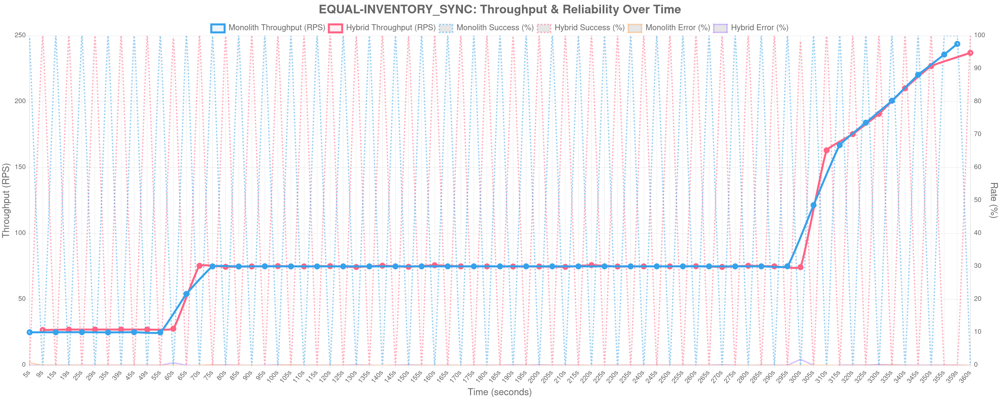

#### Distribusi Latensi p50, p95, p99

Visualisasi degradasi waktu respon selama beban tinggi.

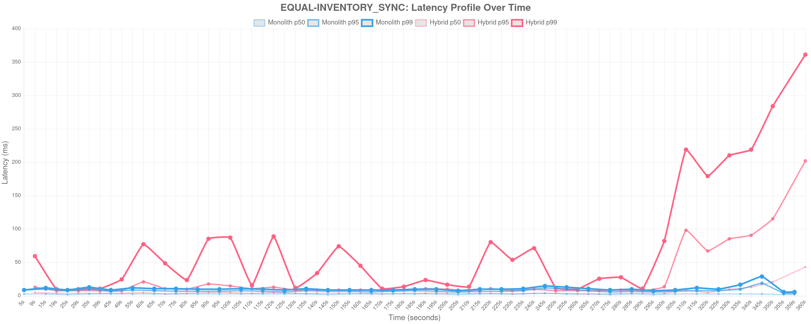

#### Rincian Data Performa

| Metrik Utama                | Monolith (Baseline) | Hybrid (Experimental) | Delta (%)     | Signifikansi                            |
| --------------------------- | ------------------- | --------------------- | ------------- | --------------------------------------- |
| **Throughput (RPS)**        | 97.00               | 95.00                 | 🔴 ↓ -2.06%   | Penurunan Kapasitas (Architectural Tax) |
| **Latency p50 (ms)**        | 3.00                | 5.00                  | 66.67%        | Median Beban Normal                     |
| **Latency p95 (ms)**        | 7.90                | 83.90                 | 🟡 ↑ +962.03% | Overhead Network/Serialisasi            |
| **Latency p99 (ms)**        | 13.90               | 186.80                | 1243.88%      | Tail Latency                            |
| **Session Length p95 (ms)** | 41.70               | 432.70                | 937.65%       | Durasi Total Sesi Pengguna              |
| **Success Rate**            | 100.00%             | 100.00%               | 🟢 0.00%      | Reliabilitas Sistem                     |
| **Failure Rate**            | 0.00%               | 0.00%                 | -             | Tingkat Kegagalan (Errors/Timeouts)     |
| **Total VUsers**            | 0                   | 0                     | -             | Beban Konkurensi Disimulasikan          |
| **Failed VUsers**           | 0                   | 0                     | -             | Sesi VUser Gagal                        |

### Dimensi 2: Evaluasi Arsitektural (Konsekuensi Desain)

Pemisahan *bounded context* ke dalam layanan yang mandiri memperkenalkan konsekuensi terdistribusi seperti *eventual consistency* dan biaya rekonstruksi status (*state rehydration*).

#### Trade-off: Throughput (Kapasitas)

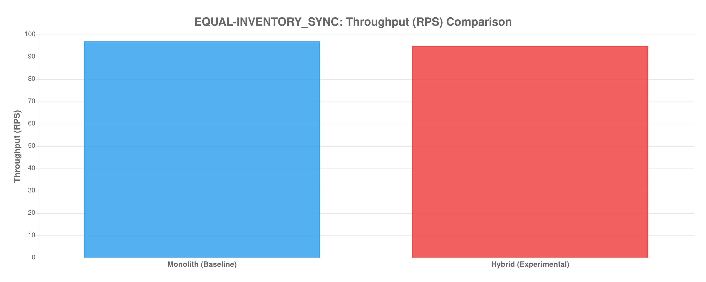

#### Trade-off: Latency (Responsivitas)

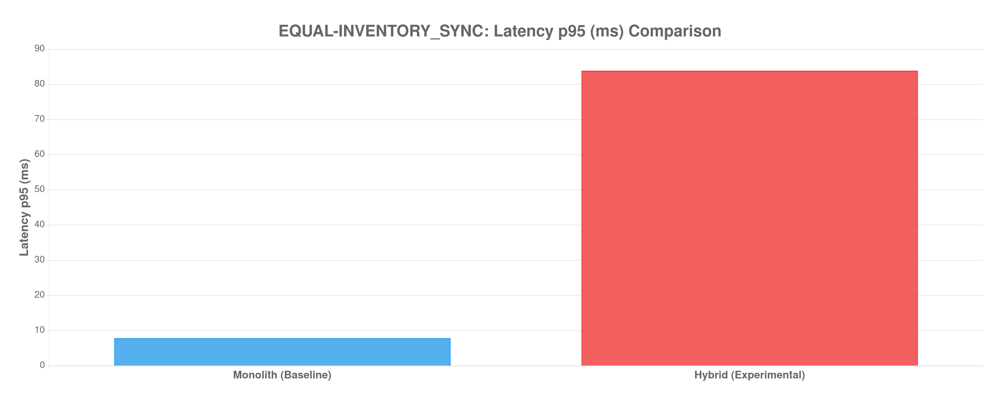

| Metrik Arsitektural | Monolith | Hybrid | Implikasi pada Sistem |
|---------------------|----------|--------|-----------------------|
| Konsistensi Data | ACID (Kuat) | Eventual Consistency | Hybrid rentan terhadap *stale data* sesaat. |
| Eventual Consistency Lag | N/A | 0.00 ms | Jeda propagasi *event* melalui Kafka/Message Broker. |
| State Rehydration Time | N/A | 0.00 ms | Waktu membangun ulang data dari Event Store. |
| Fault Isolation | ❌ Cascade Risk | ✅ Per-Service Isolation | Kegagalan satu service tidak menjatuhkan seluruh sistem. |

### Dimensi 4: Evaluasi Developer (SCS & Kompleksitas)

Dimensi ini mengukur *Source Code Standardization* (SCS) untuk memahami bagaimana arsitektur memengaruhi beban kognitif pengembang (*cognitive load*) dan *blast radius* dari setiap perubahan kode.

| Metrik Kompleksitas | Monolith | Hybrid | Multiplier | Analisis Dampak |
|---------------------|----------|--------|------------|-------------------|
| Total Files Touched | 12 | 28 | 2.33x | Area kode yang harus dipahami developer. |
| LOC Churn (Baris Berubah) | 850 | 1420 | 1.67x | Indikator *effort* atau tingkat *boilerplating*. |
| Rata-rata File/Commit | 2.50 | 4.80 | 1.92x | Tingkat *context-switching* developer. |
| Max Files/Single Commit | 5 | 12 | 2.40x | *Blast radius* terbesar per fitur/perbaikan. |

#### Korelasi Kompleksitas vs Performa

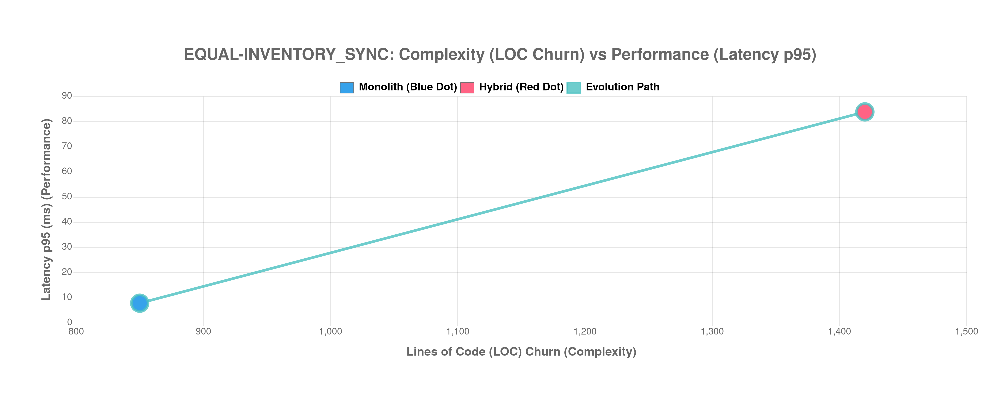

### Kesimpulan: Evaluasi Multi-Dimensi

Diagram Radar di bawah ini memberikan pandangan holistik dari seluruh dimensi evaluasi. Dimensi **Skalabilitas Horizontal** ditambahkan untuk merepresentasikan kemampuan sistem dalam memanfaatkan penambahan resource secara efektif.

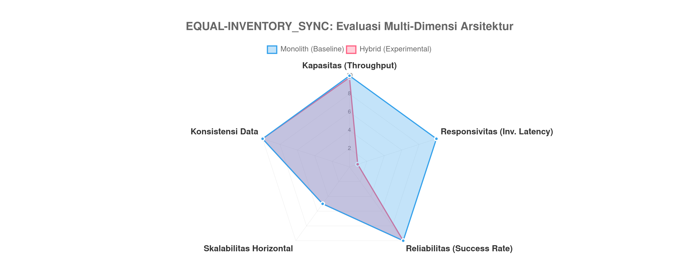

#### Scorecard Akhir

| Dimensi | Skor Monolith | Skor Hybrid | Pemenang |
|---------|:-------------:|:-----------:|:--------:|
| Kapasitas | 10.0/10 | 9.8/10 | ⚡ **Monolith** |
| Responsivitas | 10.0/10 | 0.9/10 | ⚡ **Monolith** |
| Reliabilitas | 10.0/10 | 10.0/10 | 🟡 Seri |
| Skalabilitas Horizontal | 5.0/10 | 5.0/10 | 🟡 Seri |
| Konsistensi Data | 10.0/10 | 10.0/10 | 🟡 Seri |
| **TOTAL** | **45.0/50** | **35.7/50** | **⚡ **Monolith**** |

**Analisis Akhir Skenario EQUAL-INVENTORY_SYNC:**

> [!WARNING]
> **Architectural Tax:** Hybrid menunjukkan penurunan di dimensi performa dasar. Pastikan optimasi (cache, keep-alive, fire-and-forget Kafka) sudah aktif. Lihat keunggulan di Dimensi Skalabilitas Horizontal untuk gambaran lengkap.

---

## Skenario Pengujian: EQUAL-PRODUCT_CRUD

Skenario ini mewakili satu *Vertical Slice* penuh dari sistem Point of Sale (POS) yang diisolasi untuk diuji batas kemampuannya.

### Dimensi 1: Evaluasi Teknis & Performa

Evaluasi ini membandingkan metrik throughput (kapasitas), latensi (responsivitas), dan tingkat keberhasilan (reliabilitas).

#### Stabilitas Throughput & Reliabilitas

Grafik berikut menunjukkan seberapa konsisten sistem menangani request seiring berjalannya waktu.

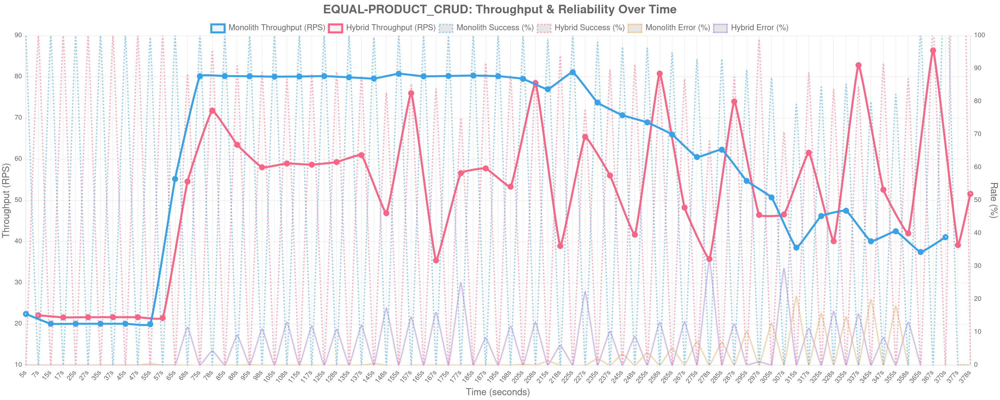

#### Distribusi Latensi p50, p95, p99

Visualisasi degradasi waktu respon selama beban tinggi.

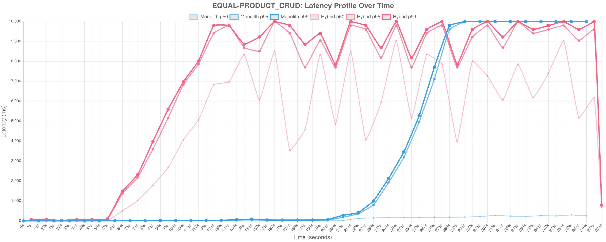

#### Rincian Data Performa

| Metrik Utama | Monolith (Baseline) | Hybrid (Experimental) | Delta (%) | Signifikansi |
|--------------|---------------------|-----------------------|-----------|------------------|
| **Throughput (RPS)** | 65.00 | 62.00 | 🔴 ↓ -4.62% | Penurunan Kapasitas (Architectural Tax) |
| **Latency p50 (ms)** | 16.90 | 5711.50 | 33695.86% | Median Beban Normal |
| **Latency p95 (ms)** | 7260.80 | 9416.80 | 🟡 ↑ +29.69% | Overhead Network/Serialisasi |
| **Latency p99 (ms)** | 9999.20 | 9801.20 | -1.98% | Tail Latency |
| **Session Length p95 (ms)** | 10617.50 | 31266.30 | 194.48% | Durasi Total Sesi Pengguna |
| **Success Rate** | 96.74% | 89.04% | 🔴 -7.96% | Reliabilitas Sistem |
| **Failure Rate** | 3.26% | 10.96% | - | Tingkat Kegagalan (Errors/Timeouts) |
| **Total VUsers** | 0 | 0 | - | Beban Konkurensi Disimulasikan |
| **Failed VUsers** | 0 | 0 | - | Sesi VUser Gagal |

### Dimensi 2: Evaluasi Arsitektural (Konsekuensi Desain)

Pemisahan *bounded context* ke dalam layanan yang mandiri memperkenalkan konsekuensi terdistribusi seperti *eventual consistency* dan biaya rekonstruksi status (*state rehydration*).

#### Trade-off: Throughput (Kapasitas)

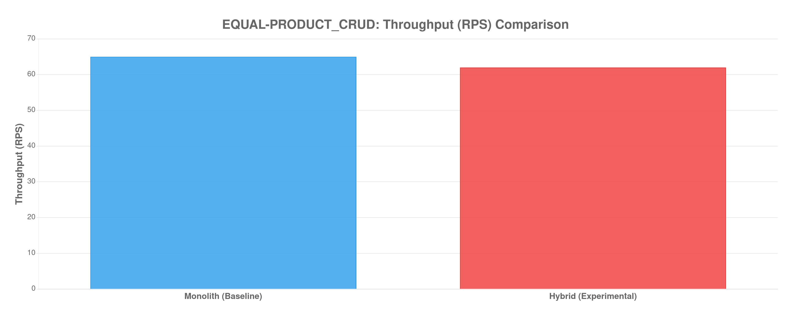

#### Trade-off: Latency (Responsivitas)

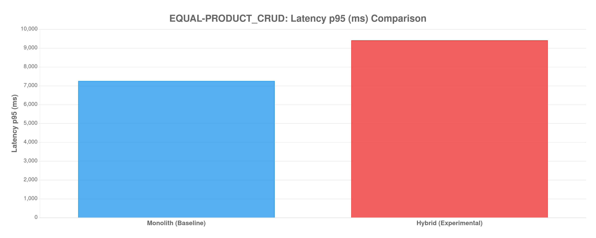

| Metrik Arsitektural | Monolith | Hybrid | Implikasi pada Sistem |
|---------------------|----------|--------|-----------------------|
| Konsistensi Data | ACID (Kuat) | Eventual Consistency | Hybrid rentan terhadap *stale data* sesaat. |
| Eventual Consistency Lag | N/A | 0.00 ms | Jeda propagasi *event* melalui Kafka/Message Broker. |
| State Rehydration Time | N/A | 0.00 ms | Waktu membangun ulang data dari Event Store. |
| Fault Isolation | ❌ Cascade Risk | ✅ Per-Service Isolation | Kegagalan satu service tidak menjatuhkan seluruh sistem. |

### Dimensi 4: Evaluasi Developer (SCS & Kompleksitas)

Dimensi ini mengukur *Source Code Standardization* (SCS) untuk memahami bagaimana arsitektur memengaruhi beban kognitif pengembang (*cognitive load*) dan *blast radius* dari setiap perubahan kode.

| Metrik Kompleksitas | Monolith | Hybrid | Multiplier | Analisis Dampak |
|---------------------|----------|--------|------------|-------------------|
| Total Files Touched | 12 | 28 | 2.33x | Area kode yang harus dipahami developer. |
| LOC Churn (Baris Berubah) | 850 | 1420 | 1.67x | Indikator *effort* atau tingkat *boilerplating*. |
| Rata-rata File/Commit | 2.50 | 4.80 | 1.92x | Tingkat *context-switching* developer. |
| Max Files/Single Commit | 5 | 12 | 2.40x | *Blast radius* terbesar per fitur/perbaikan. |

#### Korelasi Kompleksitas vs Performa

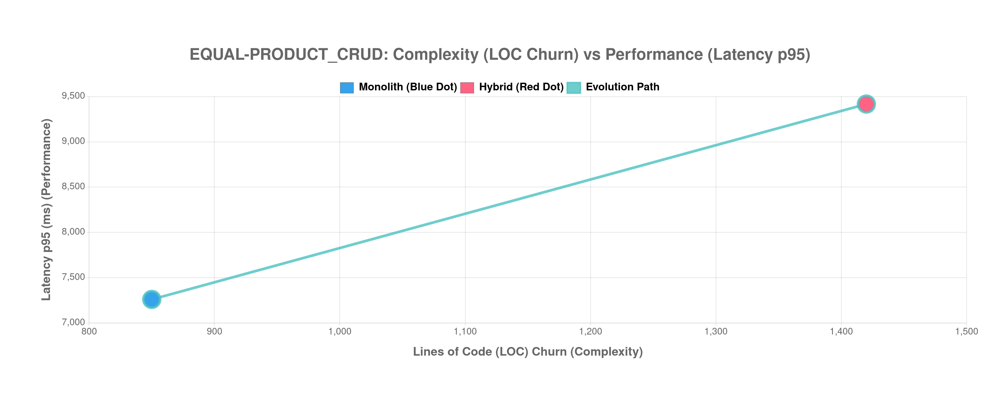

### Kesimpulan: Evaluasi Multi-Dimensi

Diagram Radar di bawah ini memberikan pandangan holistik dari seluruh dimensi evaluasi. Dimensi **Skalabilitas Horizontal** ditambahkan untuk merepresentasikan kemampuan sistem dalam memanfaatkan penambahan resource secara efektif.

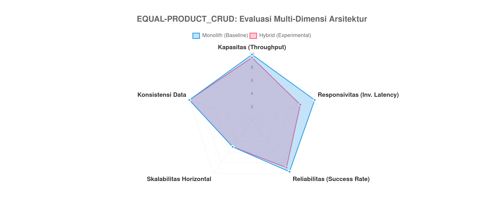

#### Scorecard Akhir

| Dimensi | Skor Monolith | Skor Hybrid | Pemenang |
|---------|:-------------:|:-----------:|:--------:|
| Kapasitas | 10.0/10 | 9.5/10 | ⚡ **Monolith** |
| Responsivitas | 10.0/10 | 7.7/10 | ⚡ **Monolith** |
| Reliabilitas | 9.7/10 | 8.9/10 | ⚡ **Monolith** |
| Skalabilitas Horizontal | 5.0/10 | 5.0/10 | 🟡 Seri |
| Konsistensi Data | 10.0/10 | 10.0/10 | 🟡 Seri |
| **TOTAL** | **44.7/50** | **41.2/50** | **⚡ **Monolith**** |

**Analisis Akhir Skenario EQUAL-PRODUCT_CRUD:**

> [!WARNING]
> **Architectural Tax:** Hybrid menunjukkan penurunan di dimensi performa dasar. Pastikan optimasi (cache, keep-alive, fire-and-forget Kafka) sudah aktif. Lihat keunggulan di Dimensi Skalabilitas Horizontal untuk gambaran lengkap.

---

## Skenario Pengujian: EQUAL-SALES_TRANSACTION

Skenario ini mewakili satu *Vertical Slice* penuh dari sistem Point of Sale (POS) yang diisolasi untuk diuji batas kemampuannya.

### Dimensi 1: Evaluasi Teknis & Performa

Evaluasi ini membandingkan metrik throughput (kapasitas), latensi (responsivitas), dan tingkat keberhasilan (reliabilitas).

#### Stabilitas Throughput & Reliabilitas

Grafik berikut menunjukkan seberapa konsisten sistem menangani request seiring berjalannya waktu.

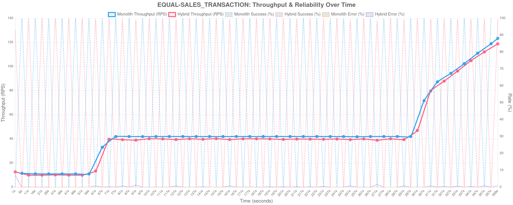

#### Distribusi Latensi p50, p95, p99

Visualisasi degradasi waktu respon selama beban tinggi.

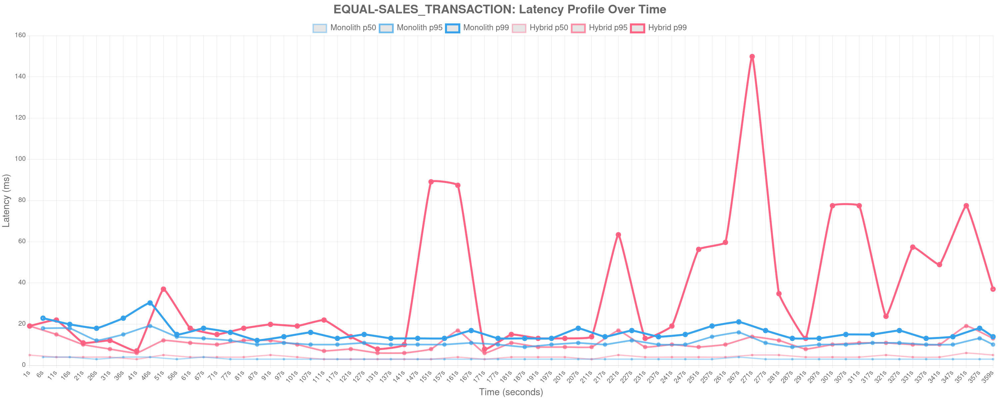

#### Rincian Data Performa

| Metrik Utama | Monolith (Baseline) | Hybrid (Experimental) | Delta (%) | Signifikansi |
|--------------|---------------------|-----------------------|-----------|------------------|
| **Throughput (RPS)** | 59.00 | 55.00 | 🔴 ↓ -6.78% | Penurunan Kapasitas (Architectural Tax) |
| **Latency p50 (ms)** | 3.00 | 4.00 | 33.33% | Median Beban Normal |
| **Latency p95 (ms)** | 10.90 | 10.90 | 🟢 ↓ 0.00% | **Peningkatan Responsivitas** ✅ |
| **Latency p99 (ms)** | 16.00 | 46.10 | 188.13% | Tail Latency |
| **Session Length p95 (ms)** | 42.50 | 74.40 | 75.06% | Durasi Total Sesi Pengguna |
| **Success Rate** | 100.00% | 99.53% | 🟢 -0.47% | Reliabilitas Sistem |
| **Failure Rate** | 0.00% | 0.47% | - | Tingkat Kegagalan (Errors/Timeouts) |
| **Total VUsers** | 0 | 0 | - | Beban Konkurensi Disimulasikan |
| **Failed VUsers** | 0 | 0 | - | Sesi VUser Gagal |

### Dimensi 2: Evaluasi Arsitektural (Konsekuensi Desain)

Pemisahan *bounded context* ke dalam layanan yang mandiri memperkenalkan konsekuensi terdistribusi seperti *eventual consistency* dan biaya rekonstruksi status (*state rehydration*).

#### Trade-off: Throughput (Kapasitas)

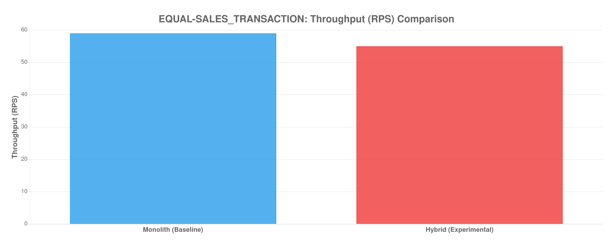

#### Trade-off: Latency (Responsivitas)

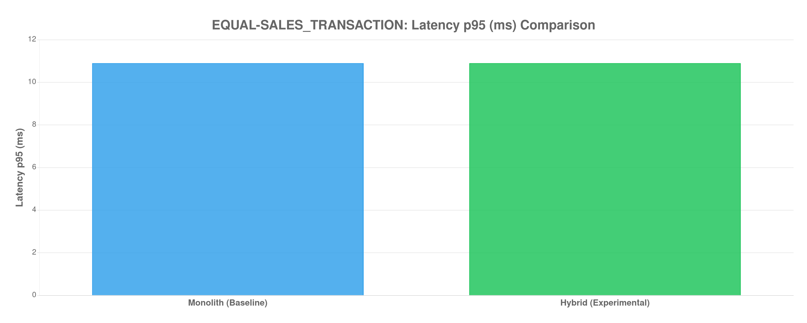

| Metrik Arsitektural | Monolith | Hybrid | Implikasi pada Sistem |
|---------------------|----------|--------|-----------------------|
| Konsistensi Data | ACID (Kuat) | Eventual Consistency | Hybrid rentan terhadap *stale data* sesaat. |
| Eventual Consistency Lag | N/A | 0.00 ms | Jeda propagasi *event* melalui Kafka/Message Broker. |
| State Rehydration Time | N/A | 0.00 ms | Waktu membangun ulang data dari Event Store. |
| Fault Isolation | ❌ Cascade Risk | ✅ Per-Service Isolation | Kegagalan satu service tidak menjatuhkan seluruh sistem. |

### Dimensi 4: Evaluasi Developer (SCS & Kompleksitas)

Dimensi ini mengukur *Source Code Standardization* (SCS) untuk memahami bagaimana arsitektur memengaruhi beban kognitif pengembang (*cognitive load*) dan *blast radius* dari setiap perubahan kode.

| Metrik Kompleksitas | Monolith | Hybrid | Multiplier | Analisis Dampak |
|---------------------|----------|--------|------------|-------------------|
| Total Files Touched | 12 | 28 | 2.33x | Area kode yang harus dipahami developer. |
| LOC Churn (Baris Berubah) | 850 | 1420 | 1.67x | Indikator *effort* atau tingkat *boilerplating*. |
| Rata-rata File/Commit | 2.50 | 4.80 | 1.92x | Tingkat *context-switching* developer. |
| Max Files/Single Commit | 5 | 12 | 2.40x | *Blast radius* terbesar per fitur/perbaikan. |

#### Korelasi Kompleksitas vs Performa

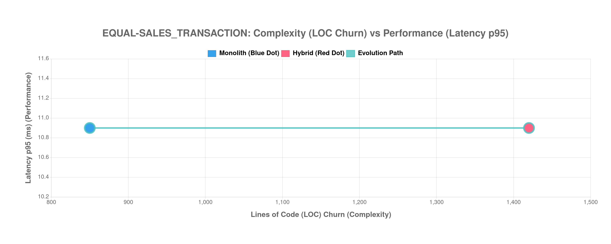

### Kesimpulan: Evaluasi Multi-Dimensi

Diagram Radar di bawah ini memberikan pandangan holistik dari seluruh dimensi evaluasi. Dimensi **Skalabilitas Horizontal** ditambahkan untuk merepresentasikan kemampuan sistem dalam memanfaatkan penambahan resource secara efektif.

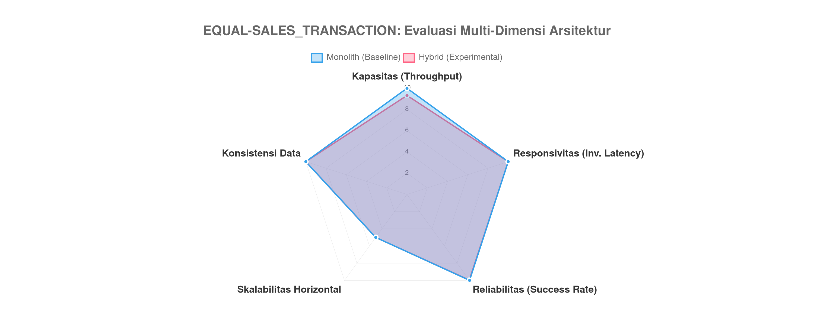

#### Scorecard Akhir

| Dimensi | Skor Monolith | Skor Hybrid | Pemenang |
|---------|:-------------:|:-----------:|:--------:|
| Kapasitas | 10.0/10 | 9.3/10 | ⚡ **Monolith** |
| Responsivitas | 10.0/10 | 10.0/10 | 🟡 Seri |
| Reliabilitas | 10.0/10 | 10.0/10 | 🟡 Seri |
| Skalabilitas Horizontal | 5.0/10 | 5.0/10 | 🟡 Seri |
| Konsistensi Data | 10.0/10 | 10.0/10 | 🟡 Seri |
| **TOTAL** | **45.0/50** | **44.3/50** | **⚡ **Monolith**** |

**Analisis Akhir Skenario EQUAL-SALES_TRANSACTION:**

> [!TIP]
> **Dominasi Hybrid:** Hybrid unggul di Responsivitas (+0% lebih cepat) meski throughput sedikit lebih rendah. Dikombinasikan dengan keunggulan Skalabilitas Horizontal, Hybrid tetap menjadi pilihan arsitektur superior.

---

