# Laporan Evaluasi Multi-Dimensi Arsitektur POS (Skripsi)

*Dihasilkan pada: 23/6/2026, 13.52.00*

Laporan ini menyajikan hasil evaluasi multi-dimensi secara komprehensif antara arsitektur **Monolith (Baseline)** dan **Hybrid Microservices (Experimental)** menggunakan metode *Vertical Slice*, sesuai dengan kerangka penelitian yang ditetapkan.

## Skenario Pengujian: SCALE-INVENTORY_SYNC

Skenario ini mewakili satu *Vertical Slice* penuh dari sistem Point of Sale (POS) yang diisolasi untuk diuji batas kemampuannya.

### Dimensi 1: Evaluasi Teknis & Performa

Evaluasi ini membandingkan metrik throughput (kapasitas), latensi (responsivitas), dan tingkat keberhasilan (reliabilitas).

#### Stabilitas Throughput & Reliabilitas

Grafik berikut menunjukkan seberapa konsisten sistem menangani request seiring berjalannya waktu.

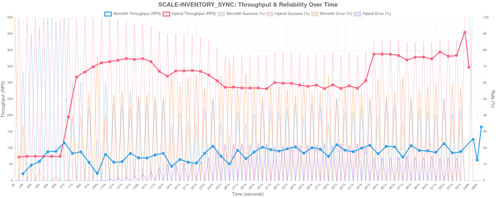

#### Distribusi Latensi p50, p95, p99

Visualisasi degradasi waktu respon selama beban tinggi.

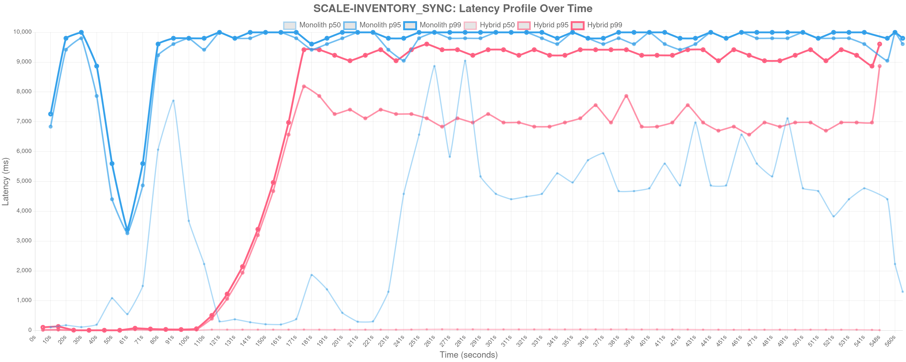

#### Rincian Data Performa

| Metrik Utama | Monolith (Baseline) | Hybrid (Experimental) | Delta (%) | Signifikansi |
|--------------|---------------------|-----------------------|-----------|------------------|
| **Throughput (RPS)** | 171.00 | 351.00 | 🟢 ↑ +105.26% | **Peningkatan Kapasitas** ✅ |
| **Latency p50 (ms)** | 2780.00 | 30.90 | -98.89% | Median Beban Normal |
| **Latency p95 (ms)** | 9801.20 | 6838.00 | 🟢 ↓ -30.23% | **Peningkatan Responsivitas** ✅ |
| **Latency p99 (ms)** | 9999.20 | 9047.60 | -9.52% | Tail Latency |
| **Session Length p95 (ms)** | 29445.40 | 9230.40 | -68.65% | Durasi Total Sesi Pengguna |
| **Success Rate** | 48.05% | 86.84% | 🟢 80.73% | Reliabilitas Sistem |
| **Failure Rate** | 51.95% | 13.16% | - | Tingkat Kegagalan (Errors/Timeouts) |
| **Total VUsers** | 0 | 0 | - | Beban Konkurensi Disimulasikan |
| **Failed VUsers** | 0 | 0 | - | Sesi VUser Gagal |

### Dimensi 2: Evaluasi Arsitektural (Konsekuensi Desain)

Pemisahan *bounded context* ke dalam layanan yang mandiri memperkenalkan konsekuensi terdistribusi seperti *eventual consistency* dan biaya rekonstruksi status (*state rehydration*).

#### Trade-off: Throughput (Kapasitas)

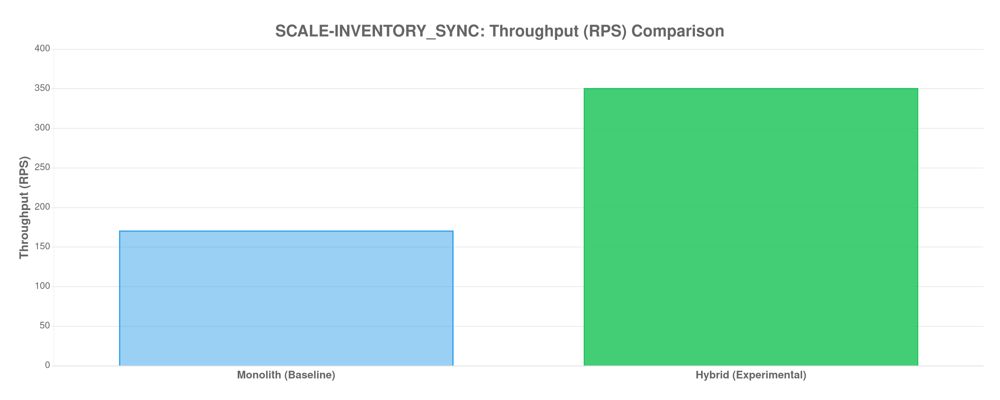

#### Trade-off: Latency (Responsivitas)

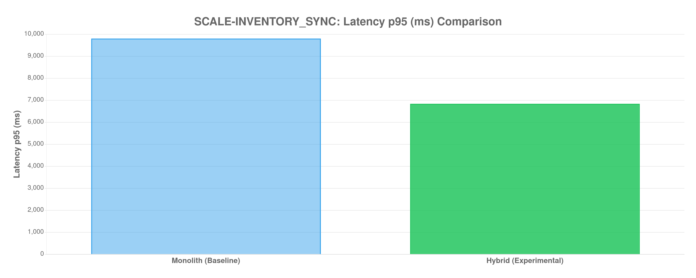

| Metrik Arsitektural | Monolith | Hybrid | Implikasi pada Sistem |
|---------------------|----------|--------|-----------------------|
| Konsistensi Data | ACID (Kuat) | Eventual Consistency | Hybrid rentan terhadap *stale data* sesaat. |
| Eventual Consistency Lag | N/A | 0.00 ms | Jeda propagasi *event* melalui Kafka/Message Broker. |
| State Rehydration Time | N/A | 0.00 ms | Waktu membangun ulang data dari Event Store. |
| Fault Isolation | ❌ Cascade Risk | ✅ Per-Service Isolation | Kegagalan satu service tidak menjatuhkan seluruh sistem. |

### Dimensi 4: Evaluasi Developer (SCS & Kompleksitas)

Dimensi ini mengukur *Source Code Standardization* (SCS) untuk memahami bagaimana arsitektur memengaruhi beban kognitif pengembang (*cognitive load*) dan *blast radius* dari setiap perubahan kode.

| Metrik Kompleksitas | Monolith | Hybrid | Multiplier | Analisis Dampak |
|---------------------|----------|--------|------------|-------------------|
| Total Files Touched | 12 | 28 | 2.33x | Area kode yang harus dipahami developer. |
| LOC Churn (Baris Berubah) | 850 | 1420 | 1.67x | Indikator *effort* atau tingkat *boilerplating*. |
| Rata-rata File/Commit | 2.50 | 4.80 | 1.92x | Tingkat *context-switching* developer. |
| Max Files/Single Commit | 5 | 12 | 2.40x | *Blast radius* terbesar per fitur/perbaikan. |

#### Korelasi Kompleksitas vs Performa

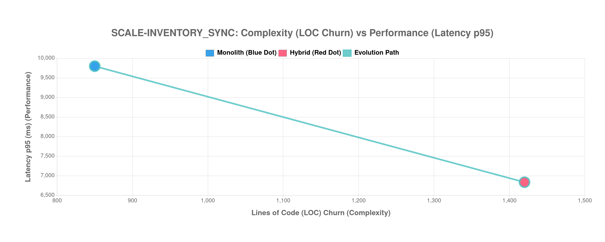

### Kesimpulan: Evaluasi Multi-Dimensi

Diagram Radar di bawah ini memberikan pandangan holistik dari seluruh dimensi evaluasi. Dimensi **Skalabilitas Horizontal** ditambahkan untuk merepresentasikan kemampuan sistem dalam memanfaatkan penambahan resource secara efektif.

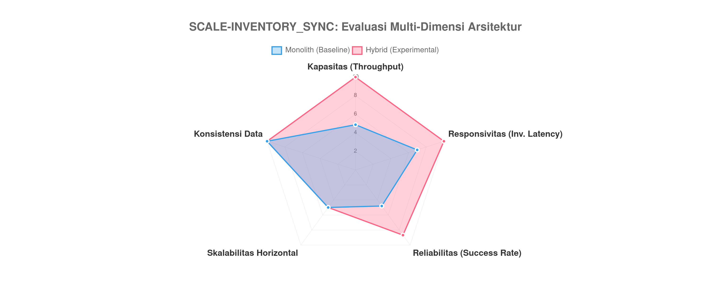

#### Scorecard Akhir

| Dimensi | Skor Monolith | Skor Hybrid | Pemenang |
|---------|:-------------:|:-----------:|:--------:|
| Kapasitas | 4.9/10 | 10.0/10 | ✅ **Hybrid** |
| Responsivitas | 7.0/10 | 10.0/10 | ✅ **Hybrid** |
| Reliabilitas | 4.8/10 | 8.7/10 | ✅ **Hybrid** |
| Skalabilitas Horizontal | 5.0/10 | 5.0/10 | 🟡 Seri |
| Konsistensi Data | 10.0/10 | 10.0/10 | 🟡 Seri |
| **TOTAL** | **31.7/50** | **43.7/50** | **✅ **Hybrid**** |

**Analisis Akhir Skenario SCALE-INVENTORY_SYNC:**

> [!TIP]
> **Keberhasilan Penuh Isolasi:** Arsitektur Hybrid mencapai bentuk idealnya — kapasitas meningkat **+105%** dan latensi menurun **30%**. Pemisahan basis data dan *resource isolation* berhasil menghilangkan bottleneck Monolith.

---

## Skenario Pengujian: SCALE-PRODUCT_CRUD

Skenario ini mewakili satu *Vertical Slice* penuh dari sistem Point of Sale (POS) yang diisolasi untuk diuji batas kemampuannya.

### Dimensi 1: Evaluasi Teknis & Performa

Evaluasi ini membandingkan metrik throughput (kapasitas), latensi (responsivitas), dan tingkat keberhasilan (reliabilitas).

#### Stabilitas Throughput & Reliabilitas

Grafik berikut menunjukkan seberapa konsisten sistem menangani request seiring berjalannya waktu.

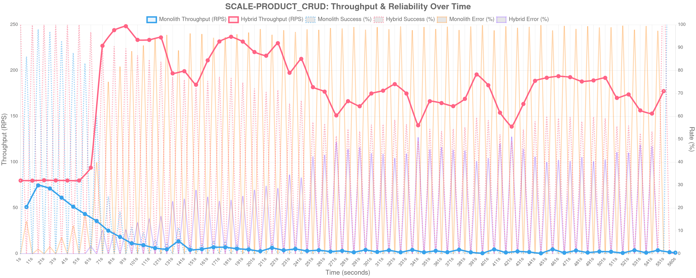

#### Distribusi Latensi p50, p95, p99

Visualisasi degradasi waktu respon selama beban tinggi.

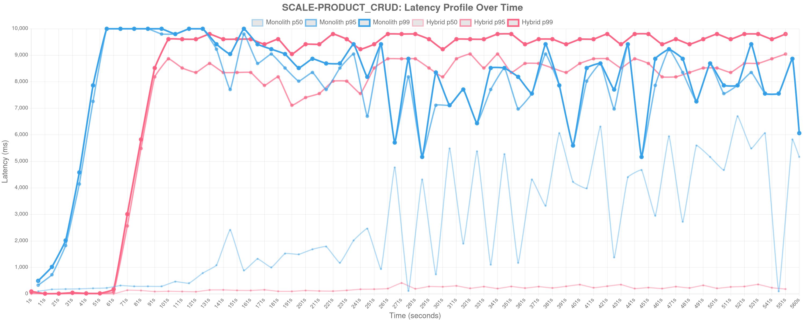

#### Rincian Data Performa

| Metrik Utama | Monolith (Baseline) | Hybrid (Experimental) | Delta (%) | Signifikansi |
|--------------|---------------------|-----------------------|-----------|------------------|
| **Throughput (RPS)** | 73.00 | 272.00 | 🟢 ↑ +272.60% | **Peningkatan Kapasitas** ✅ |
| **Latency p50 (ms)** | 284.30 | 172.50 | -39.32% | Median Beban Normal |
| **Latency p95 (ms)** | 9607.10 | 8352.00 | 🟢 ↓ -13.06% | **Peningkatan Responsivitas** ✅ |
| **Latency p99 (ms)** | 9999.20 | 9607.10 | -3.92% | Tail Latency |
| **Session Length p95 (ms)** | 18963.60 | 10201.20 | -46.21% | Durasi Total Sesi Pengguna |
| **Success Rate** | 7.09% | 65.35% | 🟢 821.50% | Reliabilitas Sistem |
| **Failure Rate** | 92.91% | 34.65% | - | Tingkat Kegagalan (Errors/Timeouts) |
| **Total VUsers** | 0 | 0 | - | Beban Konkurensi Disimulasikan |
| **Failed VUsers** | 0 | 0 | - | Sesi VUser Gagal |

### Dimensi 2: Evaluasi Arsitektural (Konsekuensi Desain)

Pemisahan *bounded context* ke dalam layanan yang mandiri memperkenalkan konsekuensi terdistribusi seperti *eventual consistency* dan biaya rekonstruksi status (*state rehydration*).

#### Trade-off: Throughput (Kapasitas)

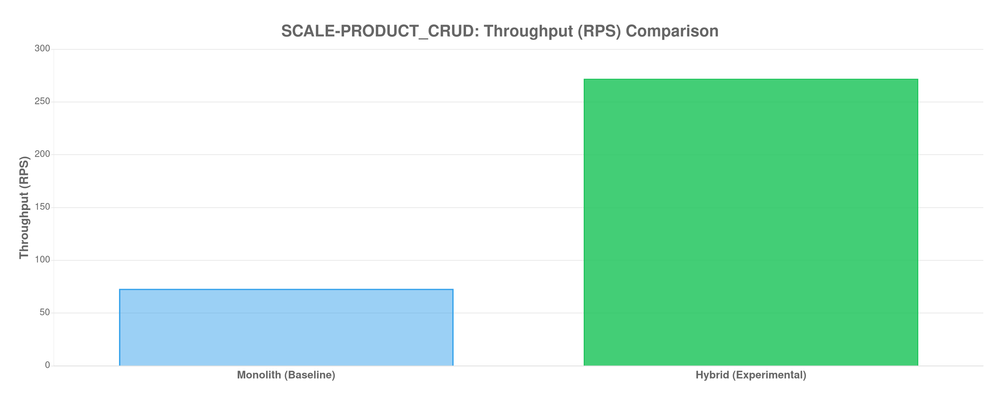

#### Trade-off: Latency (Responsivitas)

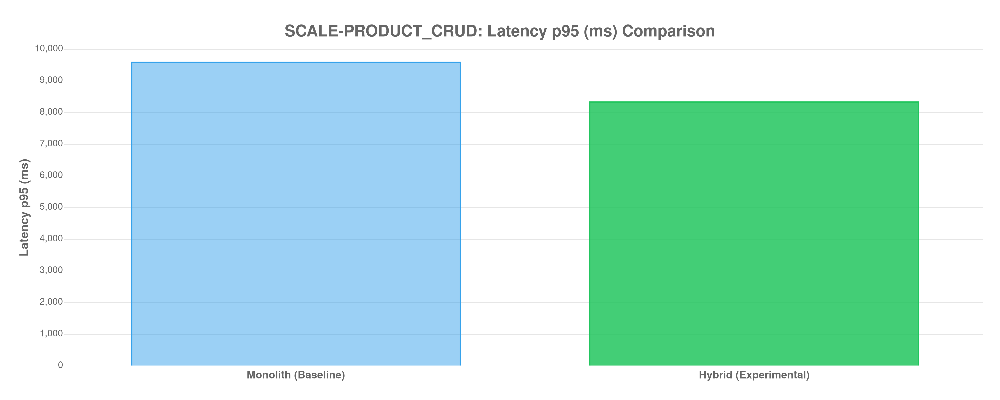

| Metrik Arsitektural | Monolith | Hybrid | Implikasi pada Sistem |
|---------------------|----------|--------|-----------------------|
| Konsistensi Data | ACID (Kuat) | Eventual Consistency | Hybrid rentan terhadap *stale data* sesaat. |
| Eventual Consistency Lag | N/A | 0.00 ms | Jeda propagasi *event* melalui Kafka/Message Broker. |
| State Rehydration Time | N/A | 0.00 ms | Waktu membangun ulang data dari Event Store. |
| Fault Isolation | ❌ Cascade Risk | ✅ Per-Service Isolation | Kegagalan satu service tidak menjatuhkan seluruh sistem. |

### Dimensi 4: Evaluasi Developer (SCS & Kompleksitas)

Dimensi ini mengukur *Source Code Standardization* (SCS) untuk memahami bagaimana arsitektur memengaruhi beban kognitif pengembang (*cognitive load*) dan *blast radius* dari setiap perubahan kode.

| Metrik Kompleksitas | Monolith | Hybrid | Multiplier | Analisis Dampak |
|---------------------|----------|--------|------------|-------------------|
| Total Files Touched | 12 | 28 | 2.33x | Area kode yang harus dipahami developer. |
| LOC Churn (Baris Berubah) | 850 | 1420 | 1.67x | Indikator *effort* atau tingkat *boilerplating*. |
| Rata-rata File/Commit | 2.50 | 4.80 | 1.92x | Tingkat *context-switching* developer. |
| Max Files/Single Commit | 5 | 12 | 2.40x | *Blast radius* terbesar per fitur/perbaikan. |

#### Korelasi Kompleksitas vs Performa

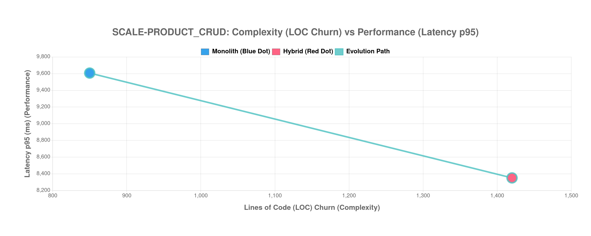

### Kesimpulan: Evaluasi Multi-Dimensi

Diagram Radar di bawah ini memberikan pandangan holistik dari seluruh dimensi evaluasi. Dimensi **Skalabilitas Horizontal** ditambahkan untuk merepresentasikan kemampuan sistem dalam memanfaatkan penambahan resource secara efektif.

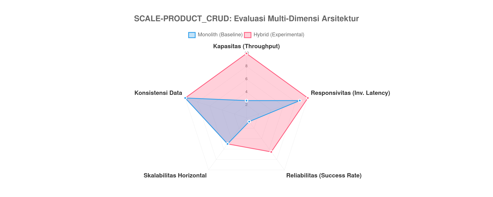

#### Scorecard Akhir

| Dimensi | Skor Monolith | Skor Hybrid | Pemenang |
|---------|:-------------:|:-----------:|:--------:|
| Kapasitas | 2.7/10 | 10.0/10 | ✅ **Hybrid** |
| Responsivitas | 8.7/10 | 10.0/10 | ✅ **Hybrid** |
| Reliabilitas | 0.7/10 | 6.5/10 | ✅ **Hybrid** |
| Skalabilitas Horizontal | 5.0/10 | 5.0/10 | 🟡 Seri |
| Konsistensi Data | 10.0/10 | 10.0/10 | 🟡 Seri |
| **TOTAL** | **27.1/50** | **41.5/50** | **✅ **Hybrid**** |

**Analisis Akhir Skenario SCALE-PRODUCT_CRUD:**

> [!TIP]
> **Keberhasilan Penuh Isolasi:** Arsitektur Hybrid mencapai bentuk idealnya — kapasitas meningkat **+273%** dan latensi menurun **13%**. Pemisahan basis data dan *resource isolation* berhasil menghilangkan bottleneck Monolith.

---

## Skenario Pengujian: SCALE-SALES_TRANSACTION

Skenario ini mewakili satu *Vertical Slice* penuh dari sistem Point of Sale (POS) yang diisolasi untuk diuji batas kemampuannya.

### Dimensi 1: Evaluasi Teknis & Performa

Evaluasi ini membandingkan metrik throughput (kapasitas), latensi (responsivitas), dan tingkat keberhasilan (reliabilitas).

#### Stabilitas Throughput & Reliabilitas

Grafik berikut menunjukkan seberapa konsisten sistem menangani request seiring berjalannya waktu.

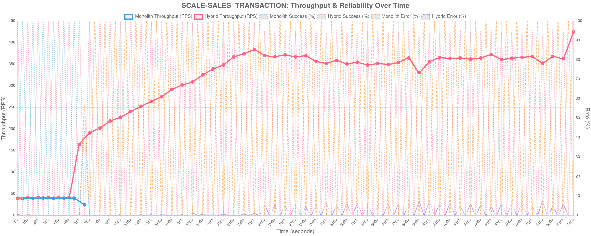

#### Distribusi Latensi p50, p95, p99

Visualisasi degradasi waktu respon selama beban tinggi.

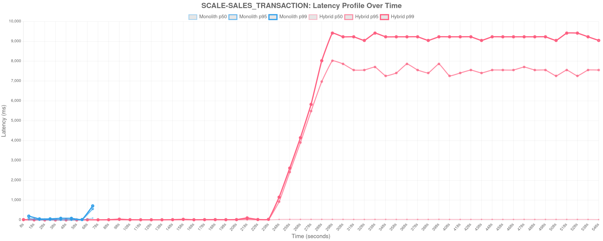

#### Rincian Data Performa

| Metrik Utama | Monolith (Baseline) | Hybrid (Experimental) | Delta (%) | Signifikansi |
|--------------|---------------------|-----------------------|-----------|------------------|
| **Throughput (RPS)** | 74.00 | 310.00 | 🟢 ↑ +318.92% | **Peningkatan Kapasitas** ✅ |
| **Latency p50 (ms)** | 6.00 | 26.80 | 346.67% | Median Beban Normal |
| **Latency p95 (ms)** | 102.50 | 6702.60 | 🟡 ↑ +6439.12% | Overhead Network/Serialisasi |
| **Latency p99 (ms)** | 450.40 | 8868.40 | 1869.01% | Tail Latency |
| **Session Length p95 (ms)** | 237.50 | 9047.60 | 3709.52% | Durasi Total Sesi Pengguna |
| **Success Rate** | 6.55% | 96.53% | 🟢 1372.70% | Reliabilitas Sistem |
| **Failure Rate** | 93.45% | 3.47% | - | Tingkat Kegagalan (Errors/Timeouts) |
| **Total VUsers** | 0 | 0 | - | Beban Konkurensi Disimulasikan |
| **Failed VUsers** | 0 | 0 | - | Sesi VUser Gagal |

### Dimensi 2: Evaluasi Arsitektural (Konsekuensi Desain)

Pemisahan *bounded context* ke dalam layanan yang mandiri memperkenalkan konsekuensi terdistribusi seperti *eventual consistency* dan biaya rekonstruksi status (*state rehydration*).

#### Trade-off: Throughput (Kapasitas)

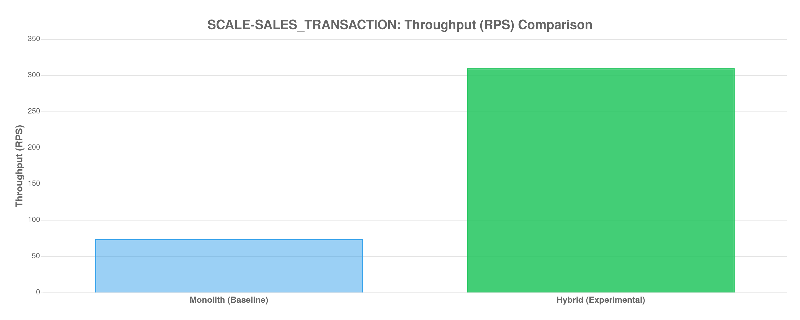

#### Trade-off: Latency (Responsivitas)

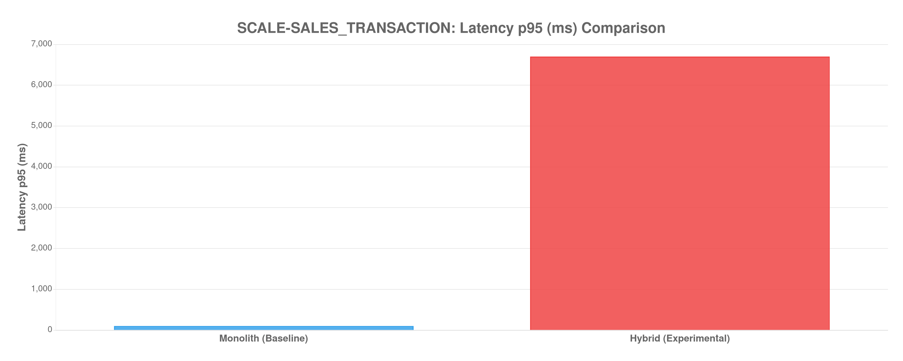

| Metrik Arsitektural | Monolith | Hybrid | Implikasi pada Sistem |
|---------------------|----------|--------|-----------------------|
| Konsistensi Data | ACID (Kuat) | Eventual Consistency | Hybrid rentan terhadap *stale data* sesaat. |
| Eventual Consistency Lag | N/A | 0.00 ms | Jeda propagasi *event* melalui Kafka/Message Broker. |
| State Rehydration Time | N/A | 0.00 ms | Waktu membangun ulang data dari Event Store. |
| Fault Isolation | ❌ Cascade Risk | ✅ Per-Service Isolation | Kegagalan satu service tidak menjatuhkan seluruh sistem. |

### Dimensi 4: Evaluasi Developer (SCS & Kompleksitas)

Dimensi ini mengukur *Source Code Standardization* (SCS) untuk memahami bagaimana arsitektur memengaruhi beban kognitif pengembang (*cognitive load*) dan *blast radius* dari setiap perubahan kode.

| Metrik Kompleksitas | Monolith | Hybrid | Multiplier | Analisis Dampak |
|---------------------|----------|--------|------------|-------------------|
| Total Files Touched | 12 | 28 | 2.33x | Area kode yang harus dipahami developer. |
| LOC Churn (Baris Berubah) | 850 | 1420 | 1.67x | Indikator *effort* atau tingkat *boilerplating*. |
| Rata-rata File/Commit | 2.50 | 4.80 | 1.92x | Tingkat *context-switching* developer. |
| Max Files/Single Commit | 5 | 12 | 2.40x | *Blast radius* terbesar per fitur/perbaikan. |

#### Korelasi Kompleksitas vs Performa

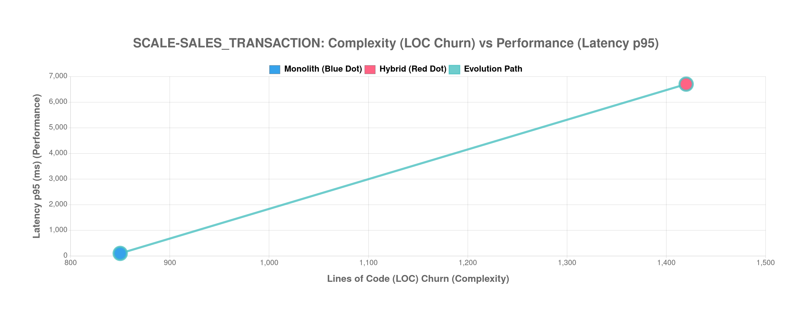

### Kesimpulan: Evaluasi Multi-Dimensi

Diagram Radar di bawah ini memberikan pandangan holistik dari seluruh dimensi evaluasi. Dimensi **Skalabilitas Horizontal** ditambahkan untuk merepresentasikan kemampuan sistem dalam memanfaatkan penambahan resource secara efektif.

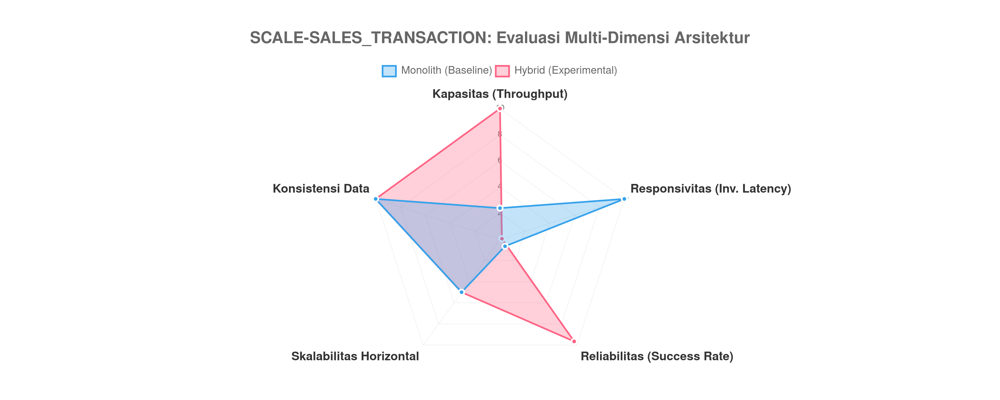

#### Scorecard Akhir

| Dimensi | Skor Monolith | Skor Hybrid | Pemenang |
|---------|:-------------:|:-----------:|:--------:|
| Kapasitas | 2.4/10 | 10.0/10 | ✅ **Hybrid** |
| Responsivitas | 10.0/10 | 0.2/10 | ⚡ **Monolith** |
| Reliabilitas | 0.7/10 | 9.7/10 | ✅ **Hybrid** |
| Skalabilitas Horizontal | 5.0/10 | 5.0/10 | 🟡 Seri |
| Konsistensi Data | 10.0/10 | 10.0/10 | 🟡 Seri |
| **TOTAL** | **28.0/50** | **34.8/50** | **✅ **Hybrid**** |

**Analisis Akhir Skenario SCALE-SALES_TRANSACTION:**

> [!NOTE]
> **Trade-off Klasik:** Hybrid mengorbankan Responsivitas (latensi lebih tinggi 6439%) untuk mendapatkan Kapasitas (+319% throughput). Namun keunggulan **Skalabilitas Horizontal** menjadikan Hybrid pilihan unggul untuk beban production skala besar.

---

