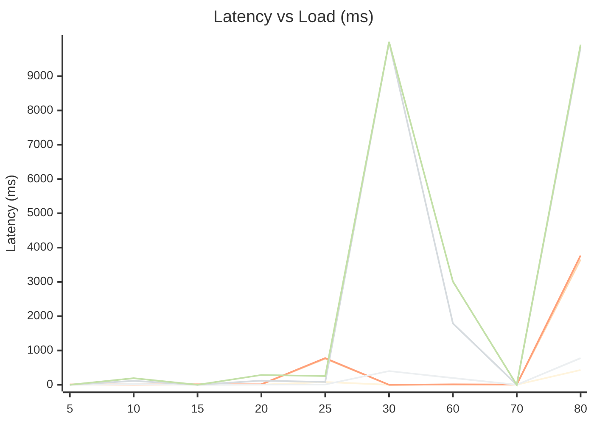
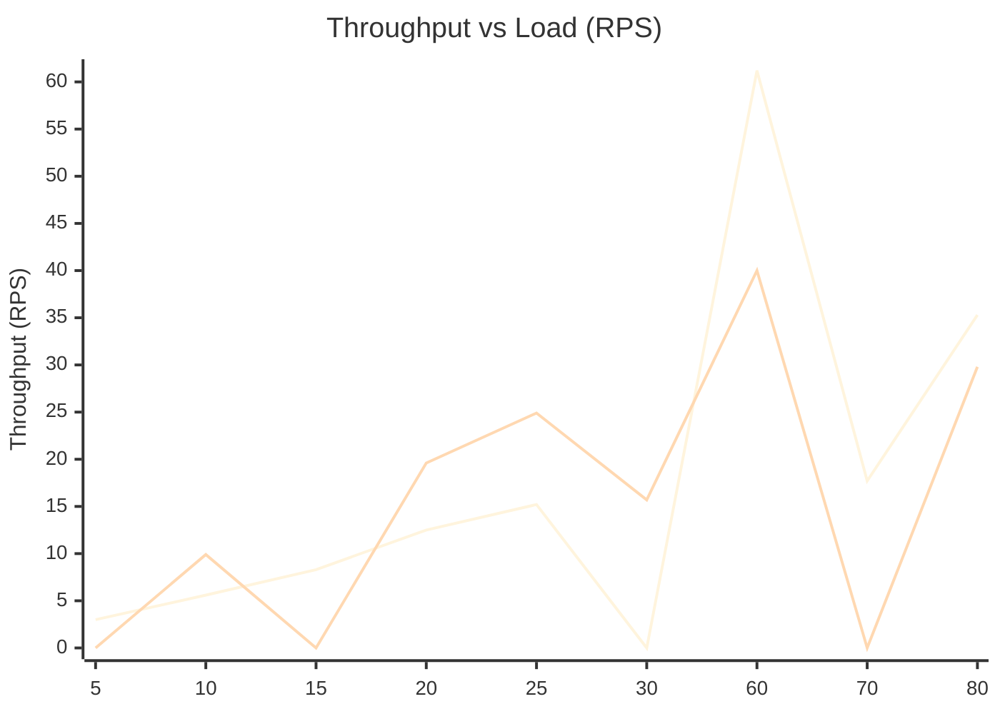
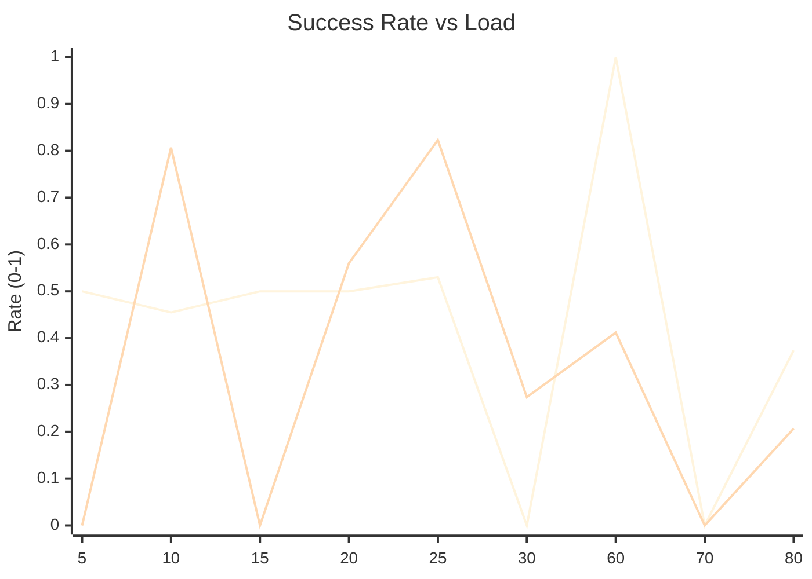

# Architectural Performance Profile

## Latency vs Load (ms)

## Throughput vs Load (RPS)

## Success Rate vs Load

## Performance Metrics Detail

| Load | Arch | Throughput | P50 | P95 | P99 | Success | Status |
|------|------|------------|-----|-----|-----|---------|--------|
| 5 | MONOLITH | 3.0 | 4.3 | 7.7 | 9.3 | 50.0% | critical |
| 10 | MONOLITH | 5.6 | 4.3 | 8.9 | 9.9 | 45.5% | critical |
| 10 | HYBRID | 9.9 | 18.8 | 113.6 | 191.8 | 80.7% | critical |
| 15 | MONOLITH | 8.3 | 3.5 | 9.0 | 12.4 | 50.0% | critical |
| 20 | MONOLITH | 12.5 | 3.5 | 7.6 | 13.8 | 50.0% | critical |
| 20 | HYBRID | 19.6 | 6.3 | 120.3 | 286.3 | 56.0% | critical |
| 25 | MONOLITH | 15.2 | 80.9 | 761.2 | 777.9 | 53.0% | critical |
| 25 | HYBRID | 24.9 | 7.9 | 83.0 | 254.2 | 82.3% | critical |
| 30 | HYBRID | 15.7 | 399.5 | 9999.2 | 9999.2 | 27.4% | critical |
| 60 | MONOLITH | 61.2 | 4.0 | 7.9 | 12.1 | 100.0% | healthy |
| 60 | HYBRID | 40.0 | 198.4 | 1790.4 | 3011.6 | 41.3% | critical |
| 70 | MONOLITH | 17.7 | 2.0 | 5.0 | 6.0 | 0.0% | critical |
| 80 | MONOLITH | 35.3 | 431.8 | 3651.5 | 3771.5 | 37.4% | critical |
| 80 | HYBRID | 29.8 | 776.7 | 9833.5 | 9917.5 | 20.7% | critical |

## Degradation Analysis

### MONOLITH Observations
- **Non-linear Latency Increase**: Jump at load 25 (P95: 7.6ms -> 761.2ms).
- **Throughput Degradation**: Dropped at load 70 despite higher target.
- **Reliability Threshold**: Success rate fell below 99% at load 70.
- **Non-linear Latency Increase**: Jump at load 80 (P95: 5.0ms -> 3651.5ms).
### HYBRID Observations
- **Non-linear Latency Increase**: Jump at load 30 (P95: 83.0ms -> 9999.2ms).
- **Throughput Degradation**: Dropped at load 30 despite higher target.
- **Non-linear Latency Increase**: Jump at load 80 (P95: 1790.4ms -> 9833.5ms).
- **Throughput Degradation**: Dropped at load 80 despite higher target.
